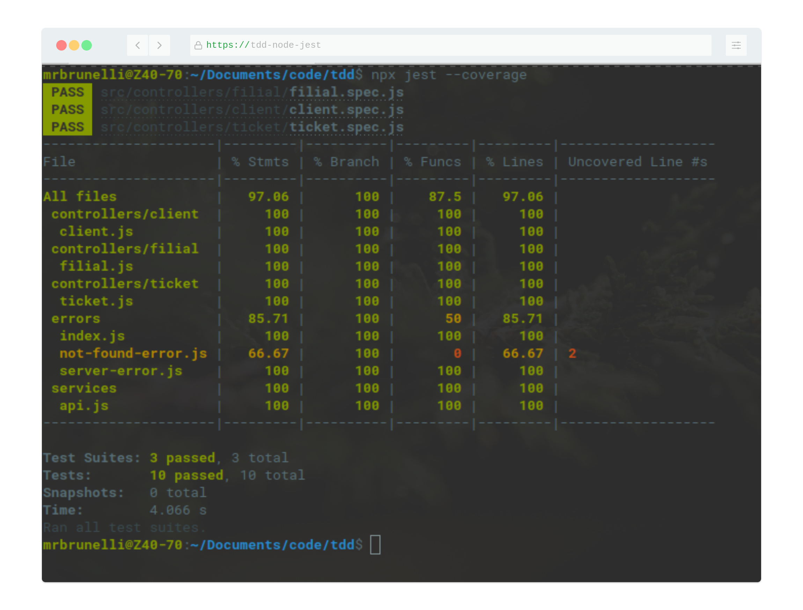

## :heavy_check_mark: TDD Node + Jest
> My studies of Test-driven development with Node.js

### Requisits
- [x] Node
- [x] Npm
- [x] Jest
- [x] Axios

### To execute
> First install the dependencies
```bash
npm install
```
> Later, execute npm test
```bash
npm test
```
> For coverage details
```bash
npx jest --coverage
```



### Easy to test features
```javascript
const FilialController = require('../filial/filial')

const makeSut = (url) => {
  const sut = new FilialController(url)
  return sut.handle(url)
}

describe('Filial Controller', () => {
  test('Should return 200 if connect in /filial', async () => {
    const statusCode = await makeSut('/api/filial')
    expect(statusCode).toBe(200)
  })

  test('Should return 500 if provided incorrectly route', async () => {
    const statusCode = await makeSut('invalid_route')
    expect(statusCode).toBe(500)
  })
})
```